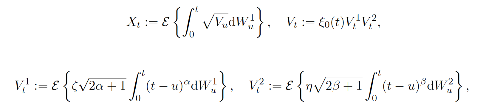
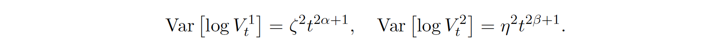
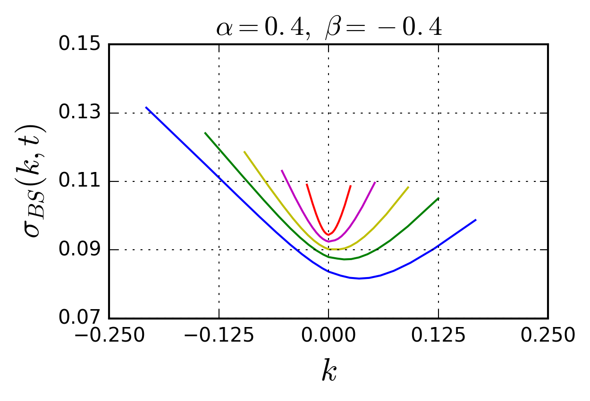

# Extended rBergomi

An extension of the rough Bergomi model, introduced by [Bayer, Friz and Gatheral](http://www.tandfonline.com/doi/full/10.1080/14697688.2015.1099717), which decouples smile and skew explosion rates, essentially by driving volatility dynamics by two (Volterra) processes of differing roughness. (The price process still only depends upon two Brownian motions in total.)

We are researching this model's theoretical justification and practical effectiveness in both realised and pricing measures, primarily in the context of the foreign exchange market (where we find standard rBergomi struggles to capture implied volatility observations). This extended model has thus far proved very promising, in particular being able to generate steep symmetric short-time smiles and skewed long-time smiles (a foreign exchange phenomenon which standard rBergomi cannot reproduce).

Python and Julia code and results forthcoming.

Using a two-dimensional Brownian motion with independent components, we define the extended rBergomi model by

  

which has a direct correspondence with standard rBergomi when the roughness indices are aligned. This extended model decouples skew and smile in the following sense

  

These explosion rates are inhibited by the same roughness index in standard rBergomi, therefore the same power-law explosion / decay over time. Decoupling them provides considerable flexibility when generating implied volatility surfaces, e.g., the following which runs from one week (red) to one year (blue) maturities

  

Still only having four true parameters, the model is not overparameterised and each parameter has a somewhat orthogonal effect on resulting surfaces (so the model should be stable under recalibration). The above surface, in a styalised sense, corresponds to those observed in the foreign exchange market. This indication from the pricing measure that the volatility process should contained two processes of differing roughness (one truly rough, the other indicatively persistent) is backed up my work in the realised measure, e.g., [Bennedsen, Lunde and Pakkanen](https://arxiv.org/abs/1610.00332).

In the realised measure, this extended rBergomi model is expected to simply correspond to the celebrated model of [Gatheral, Jaisson and Rosenbaum](https://arxiv.org/abs/1410.3394), only with two independent driving fractional Brownian motions. The assumed passage from realised to pricing measure appears more intricate than for standard rBergomi, however.
